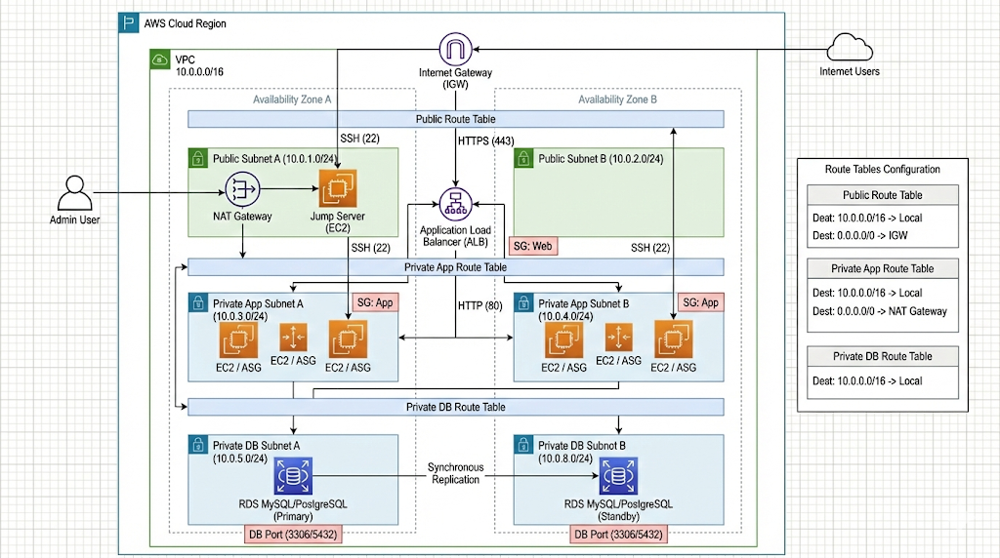
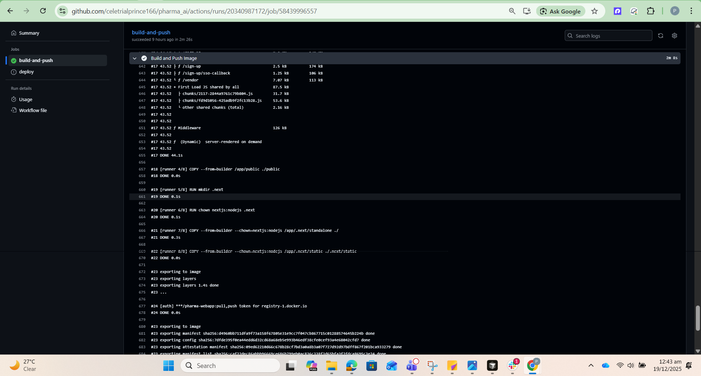
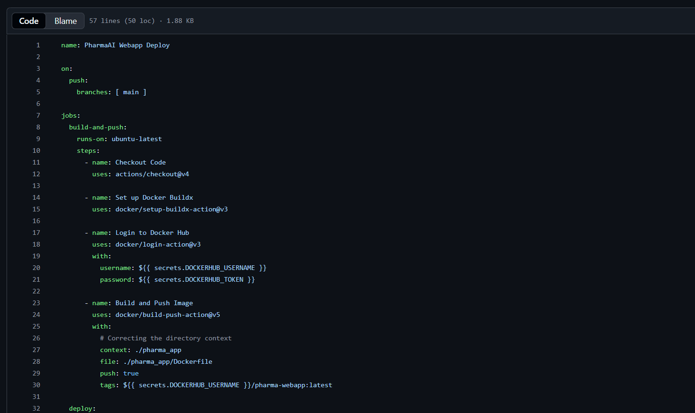
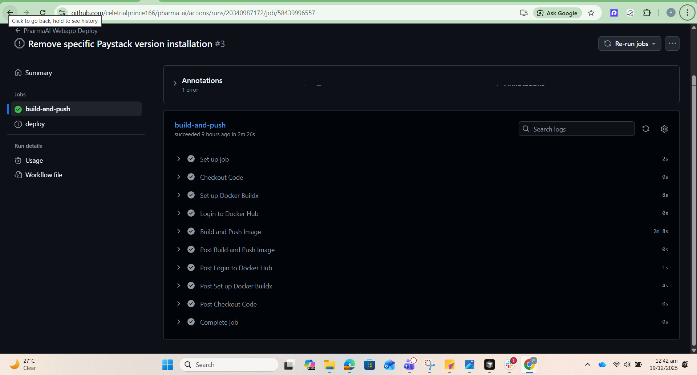
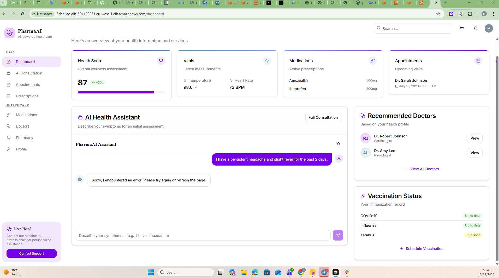
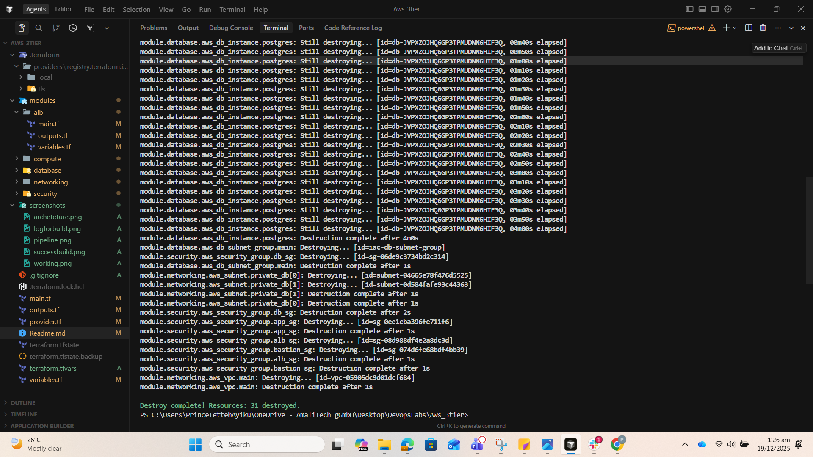

This documentation is designed to be a high-level summary of your project’s architecture and deployment. It follows industry standards by separating the "How" (Implementation) from the "What" (Architecture) while providing visual context throughout.

---

# PharmaAI: Web Application Deployment Documentation

## 1. System Architecture

The application follows a highly available, secure, and scalable **three-tier architecture** deployed on AWS.

> 
> 



### Infrastructure Components

| Component | Description |
| --- | --- |
| **Networking** | VPC with isolated subnets across 2 Availability Zones for high availability. |
| **Compute** | Next.js application running inside Docker containers on EC2 instances within an Auto Scaling Group (ASG). |
| **Database** | Amazon RDS (PostgreSQL) in a private subnet, with connection strings dynamically injected at runtime. |
| **Security** | IAM roles for EC2 access, Security Groups for traffic filtering, and a Bastion Host for secure SSH tunneling. |

---

## 2. Implementation Summary

### Phase 1: Containerization

We converted the Next.js application into a production-ready Docker image using a multi-stage build. This reduces the image size and ensures the production environment is stripped of development bloat.



### Phase 2: CI/CD Pipeline (GitHub Actions)

The deployment is fully automated. On every push to `main`, GitHub Actions:

1. Builds the Docker image.
2. Pushes the image to Docker Hub.
3. Triggers an SSH command via the **Bastion Host** to update the private EC2 instances.





### Phase 3: Infrastructure as Code (Terraform)

The entire AWS environment is managed via Terraform. Key logic includes:

* **Dynamic Linking:** Terraform captures the RDS endpoint after creation and injects it into the EC2 `user_data` script.
* **Resilient Startup:** The `user_data.sh` script includes retry logic and logging to ensure Docker starts reliably on new instances.

---

## 3. Environment Configuration

The application relies on several critical environment variables injected at runtime through the Docker `run` command.

```bash
# Example of the resilient startup command used in User Data
docker run -d \
  --name pharma-app \
  --restart always \
  -p 3000:3000 \
  -e DATABASE_URL="${database_url}" \
  -e CLERK_SECRET_KEY="${clerk_secret_key}" \
  # ... other secrets
  ${docker_username}/pharma-webapp:latest

```

---

## 4. Deployment Verification

The application is successfully accessible via the Application Load Balancer DNS.

> [!NOTE]
>`pharma-alb-12345.us-east-1.elb.amazonaws.com`).*

---

## 5. Security & Operations

* **No Secret Exposure:** All keys (Clerk, Paystack, DB) are stored as GitHub Secrets or Terraform Variables and never hardcoded in source code.
* **Monitoring:** Logs are directed to `/var/log/user-data.log` on the EC2 instances for rapid troubleshooting.
* **Scalability:** The ASG is configured to maintain a minimum of 1 and a maximum of 3 instances based on traffic.

---

